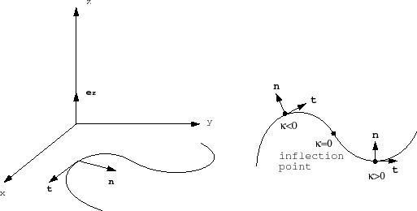
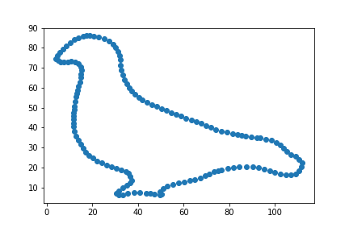

# Curvature
Calculate curvature of plane curves

## Getting Started

The data are the outlines of animal shape. The outline is given as a 150X2 matrix containing the x-coordinates and y-coordinates of a polygonal approximation to the outline.

For contour C, compute the curvature K at each point.


### Prerequisites
python 3.6

numpy 1.14

## Running the tests

Run the script in command line.

```
python Curvature.py -f data.txt
```
## Output
The output gives you a list including curvature at each point.
```
[-3.76002048e-02 -5.90877125e-02 -5.08242020e-02 -2.40337908e-02
...
 -1.99900968e-01 -2.32916727e-01]
```

Also, it will give an scatter plot of matrix:

## Authors

* **Haozhe Wang** 

## License

This project is licensed under the MIT License - see the [LICENSE.md](LICENSE.md) file for details
